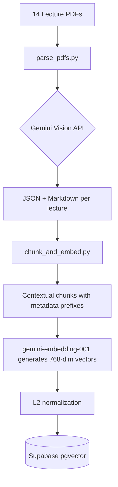
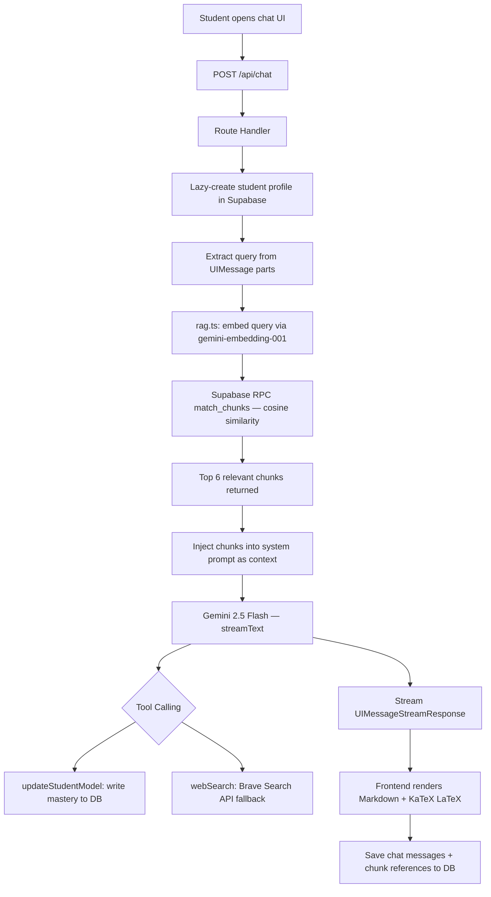
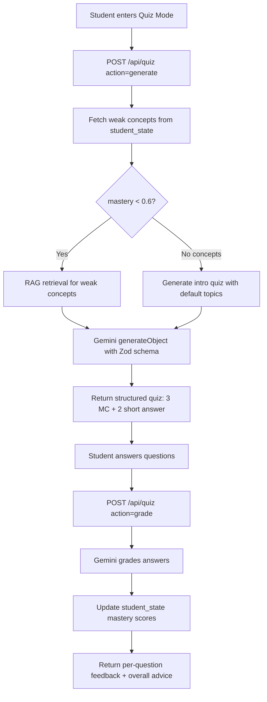
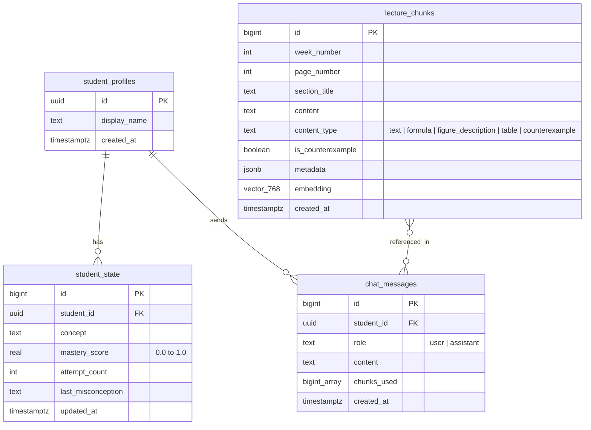

> **Language**: **English** | [繁體中文](README.zh-TW.md)

# Laser Physics AI Teaching Assistant

RAG-based AI teaching assistant for the "Introduction to Lasers" course at NYCU Department of Electrophysics. Built with Gemini 2.5 Flash, Supabase pgvector, and Vercel AI SDK v6.

## Live Demo

https://web-eight-hazel-22.vercel.app

## Screenshot


Three learning modes: **Teaching Mode** (lecture-by-lecture walkthrough), **Free Q&A** (RAG-powered chat), and **Auto Quiz** (AI-generated quizzes based on weak concepts).

## Architecture

The system consists of an offline data pipeline and a runtime chat flow.

### Offline Data Pipeline



### Runtime Chat Flow



### Auto Quiz Flow



## Tech Stack

| Category | Technology | Version | Purpose |
| :--- | :--- | :--- | :--- |
| Frontend | Next.js | 16.1.6 | Application framework |
| Frontend | React | 19.2.3 | UI library |
| AI SDK | Vercel AI SDK | 6.0.116 | Streaming, tool calling, structured output |
| AI SDK | @ai-sdk/react | 3.0.118 | React hooks (useChat) |
| AI SDK | @ai-sdk/google | 3.0.43 | Google model adapter |
| LLM | Google Gemini 2.5 Flash | - | Chat generation + vision PDF parsing + quiz generation |
| Embedding | gemini-embedding-001 | 768-dim | Vector embeddings |
| Vector DB | Supabase (pgvector) | IVFFlat | Vector similarity search + data storage |
| Styling | Tailwind CSS | v4 | Utility-first CSS |
| Math | KaTeX | 0.16.35 | LaTeX formula rendering |
| Markdown | react-markdown | 10.1.0 | Markdown parsing with remark-math + rehype-katex |
| Web Search | Brave Search API | - | Fallback for out-of-scope questions |
| PDF Parsing | google-generativeai (Python) | - | Vision-based PDF page extraction |
| Validation | Zod | v4 | Schema validation for tool inputs + structured output |
| Deployment | Vercel | Free Tier | Hosting + serverless functions |

## Database Schema



**RPC Function**: `match_chunks(query_embedding, match_threshold, match_count, filter_week)` — cosine similarity search with optional week filter.

## Project Structure

```
AI_tutor_NYCU_EP/
├── README.md                          # English (default)
├── README.zh-TW.md                    # 繁體中文
├── docs/
│   └── homepage.png                   # Homepage screenshot
├── .gitignore
├── scripts/
│   ├── parse_pdfs.py                  # Gemini Vision PDF parsing (retry + rate limiting)
│   ├── chunk_and_embed.py             # Contextual chunking + embedding pipeline
│   └── requirements.txt
├── supabase/
│   └── migrations/
│       └── 001_initial.sql            # Full DB schema + RPC function
├── web/                               # Next.js app (deployed to Vercel)
│   ├── src/
│   │   ├── app/
│   │   │   ├── api/
│   │   │   │   ├── chat/route.ts      # Chat API: RAG + Gemini streaming + tool calling
│   │   │   │   ├── lectures/route.ts  # Lectures API: week/page data for teaching mode
│   │   │   │   └── quiz/route.ts      # Quiz API: generate + grade with Gemini structured output
│   │   │   ├── layout.tsx             # Root layout (KaTeX CSS, zh-Hant locale)
│   │   │   ├── page.tsx               # Mode router (teaching / Q&A / quiz)
│   │   │   └── globals.css
│   │   ├── components/
│   │   │   ├── chat.tsx               # Free Q&A chat (AI SDK v6 useChat)
│   │   │   ├── teaching-mode.tsx      # Teaching mode: week grid → page viewer + AI explanation
│   │   │   ├── quiz-mode.tsx          # Auto quiz: generate → answer → grade → results
│   │   │   ├── mode-selector.tsx      # Landing page with 3 mode cards
│   │   │   └── markdown-renderer.tsx  # Markdown + LaTeX + counterexample rendering
│   │   └── lib/
│   │       ├── rag.ts                 # Vector search via Supabase RPC
│   │       └── supabase/
│   │           ├── client.ts          # Browser Supabase client
│   │           └── server.ts          # Server Supabase client (service role)
│   ├── .env.example
│   ├── .env.local                     # Actual secrets (gitignored)
│   └── package.json
└── 雷射導論課程講義/                    # 14 source lecture PDFs (gitignored)
```

## Key Features

- **Three Learning Modes** — Teaching mode (lecture walkthrough), Free Q&A (RAG chat), and Auto Quiz (AI-generated tests).
- **Auto Quiz Generation** — AI analyzes student weak concepts (mastery < 60%) and generates targeted quizzes with 3 multiple-choice + 2 short-answer questions. Grades answers and updates mastery scores.
- **Teaching Mode** — Browse lectures week-by-week, page-by-page. AI automatically explains each page with follow-up Q&A scoped to current content.
- **Vision-based PDF parsing** — Uses Gemini Vision to read PDF pages as images, accurately capturing physics formulas, diagrams, and bilingual content. No traditional OCR.
- **Contextual chunking** — Each chunk is prefixed with course metadata (week, page, section) to improve retrieval relevance.
- **RAG with pgvector** — 768-dimensional Gemini embeddings with cosine similarity search via Supabase RPC.
- **Gemini 2.5 Flash streaming** — Real-time streaming responses with Vercel AI SDK v6 UIMessage protocol.
- **Student knowledge tracking** — Automatically assesses mastery per concept and detects misconceptions via tool calling.
- **Brave Search fallback** — When lecture content is insufficient, the system searches the web for supplementary information.
- **LaTeX rendering** — KaTeX renders inline and display math formulas in real time during streaming.
- **Counterexample detection** — Flags common physics misconceptions from lecture materials with warnings.
- **Anonymous student profiles** — UUID-based identification via localStorage, no registration required.

## Environment Variables

| Variable | Description | Required | Source |
| :--- | :--- | :--- | :--- |
| GOOGLE_GENERATIVE_AI_API_KEY | Google AI Studio API key | Yes | [aistudio.google.com/apikey](https://aistudio.google.com/apikey) |
| BRAVE_SEARCH_API_KEY | Brave Search API key | Yes | [brave.com/search/api](https://brave.com/search/api/) |
| NEXT_PUBLIC_SUPABASE_URL | Supabase project URL | Yes | Supabase Dashboard > Settings > API |
| NEXT_PUBLIC_SUPABASE_ANON_KEY | Supabase anonymous key | Yes | Same as above |
| SUPABASE_SERVICE_ROLE_KEY | Supabase service role key | Yes | Same as above |
| CHAT_MODEL | LLM model override | No | Default: `gemini-2.5-flash` |
| EMBEDDING_MODEL | Embedding model override | No | Default: `gemini-embedding-001` |

## Getting Started

### Prerequisites

- Node.js 20+
- Python 3.10+
- Accounts: [Google AI Studio](https://aistudio.google.com), [Supabase](https://supabase.com), [Brave Search](https://brave.com/search/api/)

### Setup

1. Clone the repository.

2. Create a Supabase project (Tokyo region recommended for Asia).

3. Run the migration in Supabase SQL Editor:
   ```sql
   -- Paste contents of supabase/migrations/001_initial.sql
   ```

4. Copy `web/.env.example` to `web/.env.local` and fill in your keys.

5. Install frontend dependencies:
   ```bash
   cd web && npm install
   ```

6. Set up Python environment:
   ```bash
   python -m venv .venv
   source .venv/bin/activate
   pip install -r scripts/requirements.txt
   ```

7. Parse lecture PDFs (14 files, ~15 minutes):
   ```bash
   python scripts/parse_pdfs.py
   ```

8. Generate embeddings (371 chunks):
   ```bash
   python scripts/chunk_and_embed.py
   ```

9. Start the dev server:
   ```bash
   cd web && npm run dev
   ```
   Open http://localhost:3000

## Deployment

```bash
npm install -g vercel
cd web
vercel --prod
```

Set environment variables via the Vercel Dashboard or CLI (`vercel env add`). The framework is auto-detected as Next.js and builds with Turbopack.

## AI Tools & APIs

| Endpoint / Tool | Trigger | Action |
| :--- | :--- | :--- |
| `POST /api/chat` | User sends message | RAG retrieval → Gemini streaming response with tool calls |
| `POST /api/lectures` | Teaching mode navigation | Returns lecture structure (weeks, pages, chunks) |
| `POST /api/quiz` | Quiz mode | Generates quizzes from weak concepts / grades answers |
| `updateStudentModel` | After every substantive answer | Assesses student mastery (0-1 score) per concept, records misconceptions |
| `webSearch` | When lecture content is insufficient | Queries Brave Search API, returns top 3 results |

## Roadmap

- [x] Auto-generate quizzes based on weak concepts
- [x] Teaching mode (lecture-by-lecture walkthrough)
- [x] GitHub CI/CD auto-deploy via Vercel
- [ ] Knowledge tracing dashboard for instructors
- [ ] Multi-course support for other EP department courses
- [ ] Quiz history and progress analytics
