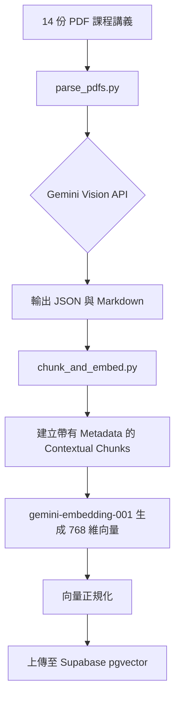
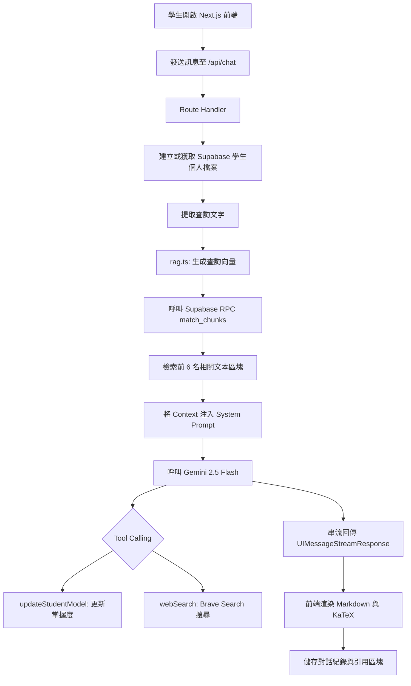
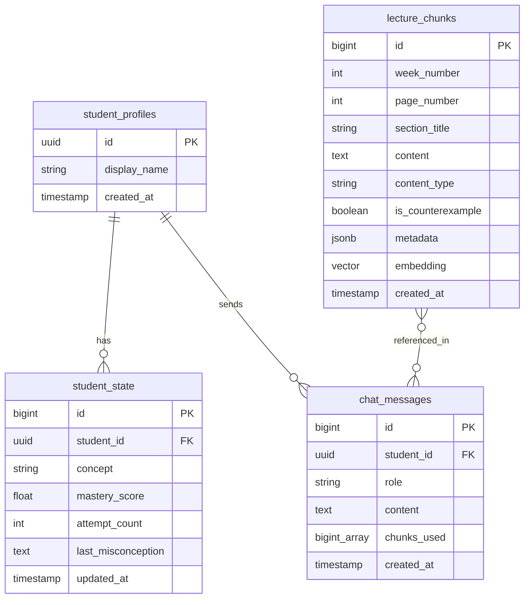

> **Language**: [English](README.md) | **繁體中文**

# 雷射導論 AI 助教

NYCU 電子物理系「雷射導論」課程 AI 助教系統

## Live Demo

Production URL: https://web-eight-hazel-22.vercel.app

## 架構概覽

本系統分為離線資料處理流水線與即時對話流程兩個部分。

### 離線資料處理流水線



### 即時對話流程



## 技術棧

| 類別 | 技術 | 版本 | 用途 |
| :--- | :--- | :--- | :--- |
| Frontend | Next.js | 16.1.6 | 應用程式框架 |
| Frontend | React | 19.2.3 | 使用者介面庫 |
| AI SDK | Vercel AI SDK | 6.0.116 | AI 整合框架 |
| AI SDK | @ai-sdk/react | 3.0.118 | React 鉤子與組件 |
| AI SDK | @ai-sdk/google | 3.0.43 | Google AI 模型適配器 |
| LLM | Google Gemini 2.5 Flash | - | 文本生成與視覺解析 |
| Embedding | gemini-embedding-001 | 768-dim | 向量嵌入模型 |
| Vector DB | Supabase | pgvector | 向量資料庫與後端服務 |
| Styling | Tailwind CSS | v4 | 樣式框架 |
| Math Rendering | KaTeX | 0.16.35 | LaTeX 公式渲染 |
| Markdown | react-markdown | 10.1.0 | Markdown 解析 |
| Web Search | Brave Search API | - | 外部資訊檢索 |
| PDF Parsing | google-generativeai | Python | PDF 視覺解析 |
| PDF Parsing | pypdfium2 | - | PDF 處理庫 |
| Validation | Zod | v4 | 模式驗證 |
| Deployment | Vercel | Free Tier | 雲端部署平台 |

## 資料庫架構



## 專案結構

```
AI_tutor_NYCU_EP/
├── README.md                          # English (default)
├── README.zh-TW.md                    # 繁體中文
├── .gitignore
├── scripts/
│   ├── parse_pdfs.py                  # Gemini Vision PDF 解析（具備重試與速率限制）
│   ├── chunk_and_embed.py             # 文本切分與向量嵌入流水線
│   └── requirements.txt
├── supabase/
│   └── migrations/
│       └── 001_initial.sql            # 資料庫 Schema 與 RPC 函數
├── web/                               # Next.js 應用程式（部署至 Vercel）
│   ├── src/
│   │   ├── app/
│   │   │   ├── api/chat/route.ts      # 對話 API：RAG、Gemini 串流與工具呼叫
│   │   │   ├── layout.tsx             # 根佈局（KaTeX 樣式、繁體中文語系）
│   │   │   ├── page.tsx
│   │   │   └── globals.css
│   │   ├── components/
│   │   │   ├── chat.tsx               # 對話介面（AI SDK v6 useChat）
│   │   │   └── markdown-renderer.tsx  # Markdown 與 LaTeX 渲染組件
│   │   └── lib/
│   │       ├── rag.ts                 # 透過 Supabase RPC 進行向量搜尋
│   │       └── supabase/
│   │           ├── client.ts          # 瀏覽器端 Supabase 客戶端
│   │           └── server.ts          # 伺服器端 Supabase 客戶端（Service Role）
│   ├── .env.example
│   ├── .env.local                     # 實際金鑰（已忽略）
│   └── package.json
└── 雷射導論課程講義/                    # 14 份原始 PDF 講義（已忽略）
```

## 核心功能

- **基於視覺的 PDF 解析** — 不使用傳統 OCR，而是透過 Gemini Vision 直接解析物理公式與圖表。
- **脈絡化文本切分** — 在檢索區塊前加入課程 Metadata 前綴，提升檢索精準度。
- **pgvector 向量搜尋** — 使用 768 維 Gemini 嵌入向量進行餘弦相似度搜尋。
- **Gemini 2.5 Flash 串流對話** — 支援工具呼叫與即時回應。
- **學生知識追蹤** — 自動評估各概念的掌握度並偵測常見誤解。
- **Brave Search 網頁搜尋** — 當講義內容不足以回答時，自動切換至外部搜尋。
- **KaTeX 公式渲染** — 完整呈現物理與數學公式。
- **誤解偵測與警告** — 標記物理學中的常見錯誤觀念並提供提醒。
- **匿名學生檔案** — 使用 UUID 與 localStorage 實現無須註冊的個人化體驗。

## 環境變數

| 變數名稱 | 描述 | 必填 | 取得來源 |
| :--- | :--- | :--- | :--- |
| GOOGLE_GENERATIVE_AI_API_KEY | Google AI Studio 金鑰 | 是 | aistudio.google.com/apikey |
| BRAVE_SEARCH_API_KEY | Brave Search API 金鑰 | 是 | brave.com/search/api |
| NEXT_PUBLIC_SUPABASE_URL | Supabase 專案 URL | 是 | Supabase Dashboard |
| NEXT_PUBLIC_SUPABASE_ANON_KEY | Supabase Anon 金鑰 | 是 | Supabase Dashboard |
| SUPABASE_SERVICE_ROLE_KEY | Supabase Service Role 金鑰 | 是 | Supabase Dashboard |
| CHAT_MODEL | LLM 模型名稱 | 否 | 預設：gemini-2.5-flash |
| EMBEDDING_MODEL | 向量嵌入模型名稱 | 否 | 預設：gemini-embedding-001 |

## 快速入門

### 前置作業

- Node.js 20 以上版本
- Python 3.10 以上版本
- Google AI Studio、Supabase 與 Brave Search 帳號

### 安裝步驟

1. 複製儲存庫。
2. 建立 Supabase 專案，建議選擇東京區域。
3. 在 Supabase SQL Editor 執行 `supabase/migrations/001_initial.sql`。
4. 將 `web/.env.example` 複製為 `web/.env.local` 並填入金鑰。
5. 安裝前端依賴：
   ```bash
   cd web && npm install
   ```
6. 設定 Python 虛擬環境：
   ```bash
   python -m venv .venv
   source .venv/bin/activate
   pip install -r scripts/requirements.txt
   ```
7. 解析 PDF 講義（14 份，約需 15 分鐘）：
   ```bash
   python scripts/parse_pdfs.py
   ```
8. 建立向量索引（371 個文本區塊）：
   ```bash
   python scripts/chunk_and_embed.py
   ```
9. 啟動開發伺服器：
   ```bash
   cd web && npm run dev
   ```
   開啟 http://localhost:3000

## 部署

```bash
npm install -g vercel
cd web
vercel --prod
```

透過 Vercel Dashboard 或 CLI 設定環境變數。系統會自動偵測 Next.js 並使用 Turbopack 進行建置。

## AI 工具

| 工具 | 用途 |
| :--- | :--- |
| updateStudentModel | 在每次回答後，Gemini 評估學生的掌握程度並更新至 `student_state` 資料表 |
| webSearch | 當講義內容不足以回答問題時，呼叫 Brave Search API 搜尋補充資訊 |

## 未來展望

- 根據學生薄弱概念自動生成測驗
- 為授課教師提供知識追蹤儀表板
- 支援電子物理系其他課程
- 整合 GitHub 實現 CI/CD 自動部署
