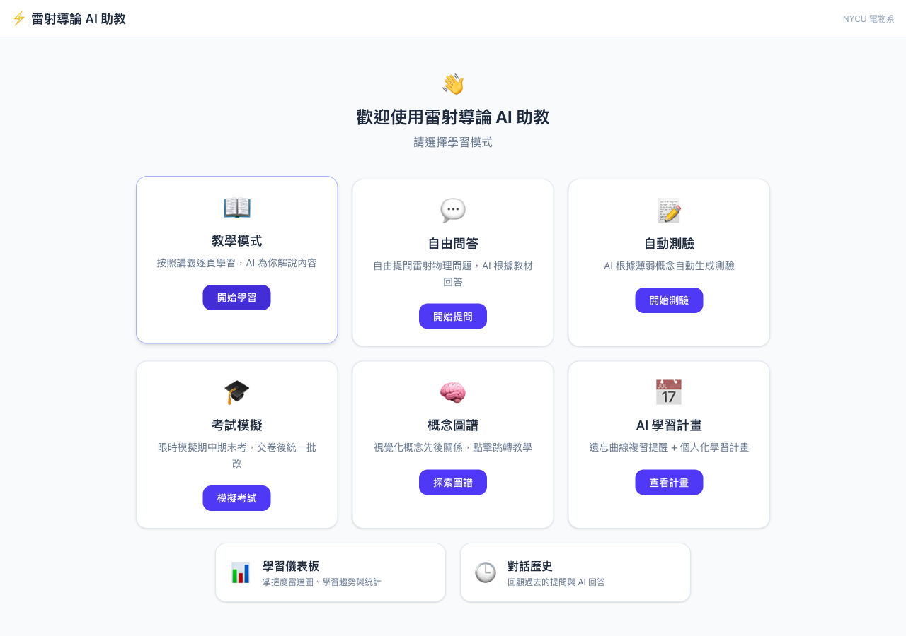
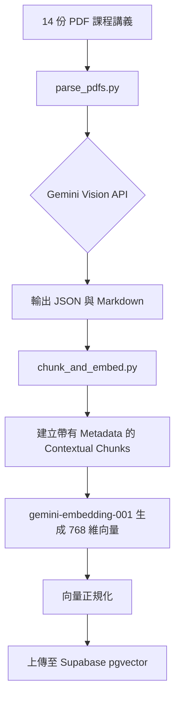
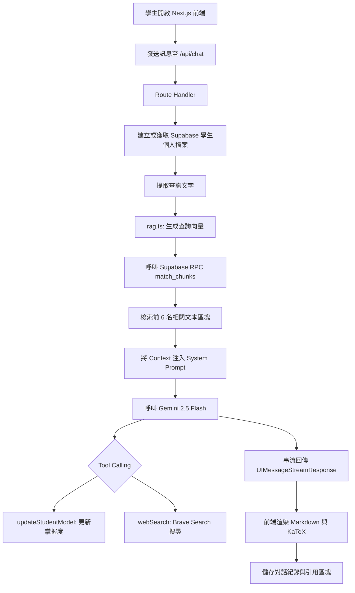
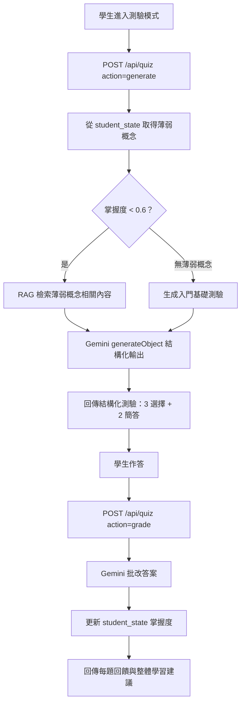
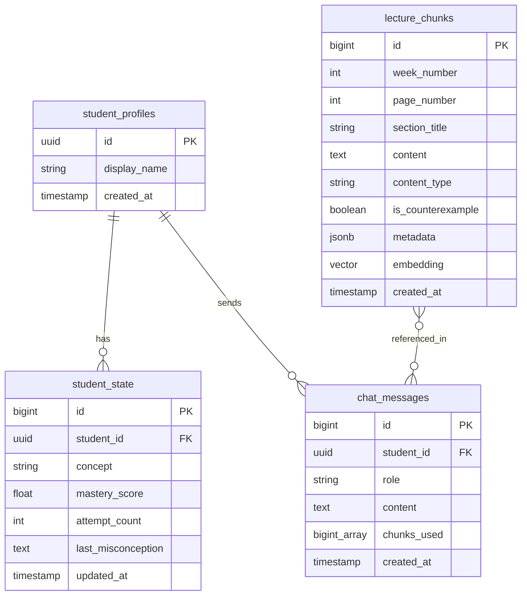

> **Language**: [English](README.md) | **繁體中文**

# 雷射導論 AI 助教

基於 RAG (Retrieval-Augmented Generation) 架構的 AI 助教系統，專為陽明交通大學電子物理系「雷射導論」課程設計。使用 Gemini 2.5 Flash、Supabase pgvector 與 Vercel AI SDK v6 建構。

## Live Demo

https://web-eight-hazel-22.vercel.app

## 首頁截圖



八種學習模式：**教學模式**（逐週逐頁講義導讀）、**自由問答**（RAG 智慧對話）、**自動測驗**（AI 根據薄弱概念自動出題）、**考試模擬**（限時期中/期末考模擬）、**概念圖譜**（互動式概念先修關係圖）、**AI 學習計畫**（遺忘曲線複習 + 個人化週計畫）、**學習儀表板**（雷達圖、趨勢、統計）、**對話歷史**（分段式對話回顧）。

## 架構概覽

本系統分為離線資料處理流水線與即時對話流程兩個部分。

### 離線資料處理流水線



### 即時對話流程



### 自動測驗流程



## 技術棧

| 類別 | 技術 | 版本 | 用途 |
| :--- | :--- | :--- | :--- |
| Frontend | Next.js | 16.1.6 | 應用程式框架 |
| Frontend | React | 19.2.3 | 使用者介面庫 |
| AI SDK | Vercel AI SDK | 6.0.116 | AI 整合框架（串流、工具呼叫、結構化輸出） |
| AI SDK | @ai-sdk/react | 3.0.118 | React 鉤子與組件 |
| AI SDK | @ai-sdk/google | 3.0.43 | Google AI 模型適配器 |
| LLM | Google Gemini 2.5 Flash | - | 文本生成、視覺解析、測驗出題 |
| Embedding | gemini-embedding-001 | 768-dim | 向量嵌入模型 |
| Vector DB | Supabase | pgvector | 向量資料庫與後端服務 |
| Styling | Tailwind CSS | v4 | 樣式框架 |
| Math Rendering | KaTeX | 0.16.35 | LaTeX 公式渲染 |
| Markdown | react-markdown | 10.1.0 | Markdown 解析（含 remark-gfm 表格支援） |
| Charts | Recharts | 2.x | 雷達圖、趨勢線、活動長條圖 |
| Web Search | Brave Search API | - | 外部資訊檢索 |
| PDF Parsing | google-generativeai | Python | PDF 視覺解析 |
| PDF Parsing | pypdfium2 | - | PDF 處理庫 |
| Validation | Zod | v4 | 模式驗證與結構化輸出 |
| Deployment | Vercel | Free Tier | 雲端部署平台 |

## 資料庫架構



## 專案結構

```
AI_tutor_NYCU_EP/
├── README.md                          # English (default)
├── README.zh-TW.md                    # 繁體中文
├── docs/
│   └── homepage.png                   # 首頁截圖
├── .gitignore
├── scripts/
│   ├── parse_pdfs.py                  # Gemini Vision PDF 解析（具備重試與速率限制）
│   ├── chunk_and_embed.py             # 文本切分與向量嵌入流水線
│   ├── extract_slides.py             # PDF 轉 JPEG 並上傳至 Supabase Storage
│   └── requirements.txt
├── supabase/
│   └── migrations/
│       └── 001_initial.sql            # 資料庫 Schema 與 RPC 函數
├── web/                               # Next.js 應用程式（部署至 Vercel）
│   ├── src/
│   │   ├── app/
│   │   │   ├── api/
│   │   │   │   ├── chat/route.ts      # 對話 API：RAG、Gemini 串流與工具呼叫
│   │   │   │   ├── lectures/route.ts  # 講義 API：教學模式的週次/頁面資料
│   │   │   │   ├── quiz/route.ts      # 測驗 API：Gemini 結構化輸出生成與批改
│   │   │   │   ├── exam/route.ts      # 考試 API：限時期中/期末考模擬與批改
│   │   │   │   ├── dashboard/route.ts # 儀表板 API：掌握度統計與活動數據
│   │   │   │   ├── history/route.ts   # 歷史 API：分段式對話紀錄
│   │   │   │   └── study-plan/route.ts# 學習計畫 API：遺忘曲線 + AI 個人化計畫
│   │   │   ├── layout.tsx             # 根佈局（KaTeX 樣式、繁體中文語系）
│   │   │   ├── page.tsx               # 模式路由（8 種模式）
│   │   │   └── globals.css
│   │   ├── components/
│   │   │   ├── chat.tsx               # 自由問答對話介面（AI SDK v6 useChat）
│   │   │   ├── teaching-mode.tsx      # 教學模式：投影片原圖 + AI 解說
│   │   │   ├── quiz-mode.tsx          # 自動測驗：出題 → 作答 → 批改 → 結果
│   │   │   ├── exam-mode.tsx          # 考試模擬：計時、統一批改、等第制
│   │   │   ├── knowledge-graph.tsx    # 概念圖譜：桌面 SVG 圖 + 手機卡片列表
│   │   │   ├── study-plan.tsx         # 學習計畫：遺忘曲線 + AI 個人化週計畫
│   │   │   ├── dashboard.tsx          # 儀表板：雷達圖、趨勢線、活動統計
│   │   │   ├── chat-history.tsx       # 對話歷史：分段列表 + 對話回放
│   │   │   ├── mode-selector.tsx      # 首頁模式選擇（3+3+2 佈局）
│   │   │   └── markdown-renderer.tsx  # Markdown + LaTeX + GFM 表格渲染
│   │   └── lib/
│   │       ├── rag.ts                 # 透過 Supabase RPC 進行向量搜尋
│   │       └── supabase/
│   │           ├── client.ts          # 瀏覽器端 Supabase 客戶端
│   │           └── server.ts          # 伺服器端 Supabase 客戶端（Service Role）
│   ├── .env.example
│   ├── .env.local                     # 實際金鑰（已忽略）
│   └── package.json
└── 雷射導論課程講義/                    # 14 份原始 PDF 講義（已忽略）
```

## 核心功能

- **八種學習模式** — 教學、問答、測驗、考試模擬、概念圖譜、AI 學習計畫、儀表板、對話歷史。
- **考試模擬** — 限時模擬期中/期末考（50/60 分鐘），7 選擇 + 3 簡答，作答中不顯示答案，交卷後統一批改並給予等第（A+ ~ F）與逐題回饋。
- **概念知識圖譜** — 互動式 SVG 視覺化 16 個雷射物理概念（光學、共振腔、量子、雷射四大類），箭頭標示先修關係，點擊可查看詳情或跳轉教學模式。手機自動切換為卡片列表。
- **AI 個人化學習計畫** — 基於遺忘曲線（retention = mastery × e^(-days/7)）計算記憶衰退，Gemini 生成個人化週計畫，包含複習優先順序與具體練習建議。
- **學習儀表板** — 掌握度雷達圖、分數趨勢線、學習活動長條圖、概念掌握明細表格。6 項摘要統計卡片。使用 Recharts 繪製。
- **對話歷史** — 以 30 分鐘間隔自動分段，支援回顧過去的提問與 AI 回答，附帶時間戳記。
- **自動測驗生成** — AI 分析學生薄弱概念（掌握度 < 60%），自動生成針對性測驗，批改後更新掌握度分數。
- **教學模式** — 按週瀏覽講義，左側顯示原始投影片圖片，右側 AI 自動解說，支援追問。
- **基於視覺的 PDF 解析** — 不使用傳統 OCR，而是透過 Gemini Vision 直接解析物理公式與圖表。
- **pgvector 向量搜尋** — 使用 768 維 Gemini 嵌入向量進行餘弦相似度搜尋。
- **學生知識追蹤** — 自動評估各概念的掌握度並偵測常見誤解。
- **Brave Search 網頁搜尋** — 當講義內容不足以回答時，自動切換至外部搜尋。
- **KaTeX 公式渲染** — 完整呈現物理與數學公式。
- **手機響應式設計** — 全部 8 種模式支援手機螢幕，自適應佈局（卡片列表、下拉選單、垂直按鈕）。
- **匿名學生檔案** — 使用 UUID 與 localStorage 實現無須註冊的個人化體驗。

## 環境變數

| 變數名稱 | 描述 | 必填 | 取得來源 |
| :--- | :--- | :--- | :--- |
| GOOGLE_GENERATIVE_AI_API_KEY | Google AI Studio 金鑰 | 是 | aistudio.google.com/apikey |
| BRAVE_SEARCH_API_KEY | Brave Search API 金鑰 | 是 | brave.com/search/api |
| NEXT_PUBLIC_SUPABASE_URL | Supabase 專案 URL | 是 | Supabase Dashboard |
| NEXT_PUBLIC_SUPABASE_ANON_KEY | Supabase Anon 金鑰 | 是 | Supabase Dashboard |
| SUPABASE_SERVICE_ROLE_KEY | Supabase Service Role 金鑰 | 是 | Supabase Dashboard |
| CHAT_MODEL | LLM 模型名稱 | 否 | 預設：gemini-2.5-flash |
| EMBEDDING_MODEL | 向量嵌入模型名稱 | 否 | 預設：gemini-embedding-001 |

## 快速入門

### 前置作業

- Node.js 20 以上版本
- Python 3.10 以上版本
- Google AI Studio、Supabase 與 Brave Search 帳號

### 安裝步驟

1. 複製儲存庫。
2. 建立 Supabase 專案，建議選擇東京區域。
3. 在 Supabase SQL Editor 執行 `supabase/migrations/001_initial.sql`。
4. 將 `web/.env.example` 複製為 `web/.env.local` 並填入金鑰。
5. 安裝前端依賴：
   ```bash
   cd web && npm install
   ```
6. 設定 Python 虛擬環境：
   ```bash
   python -m venv .venv
   source .venv/bin/activate
   pip install -r scripts/requirements.txt
   ```
7. 解析 PDF 講義（14 份，約需 15 分鐘）：
   ```bash
   python scripts/parse_pdfs.py
   ```
8. 建立向量索引（371 個文本區塊）：
   ```bash
   python scripts/chunk_and_embed.py
   ```
9. 啟動開發伺服器：
   ```bash
   cd web && npm run dev
   ```
   開啟 http://localhost:3000

## 部署

```bash
npm install -g vercel
cd web
vercel --prod
```

透過 Vercel Dashboard 或 CLI 設定環境變數。系統會自動偵測 Next.js 並使用 Turbopack 進行建置。

## AI 工具與 API

| 端點 / 工具 | 觸發時機 | 功能 |
| :--- | :--- | :--- |
| `POST /api/chat` | 使用者發送訊息 | RAG 檢索 → Gemini 串流回覆，含工具呼叫 |
| `POST /api/lectures` | 教學模式瀏覽 | 回傳講義結構（週次、頁面、內容區塊） |
| `POST /api/quiz` | 測驗模式 | 根據薄弱概念生成測驗 / 批改答案 |
| `POST /api/exam` | 考試模擬 | 生成限時期中/期末考 / 統一批改 |
| `GET /api/dashboard` | 儀表板頁面 | 回傳掌握度統計、活動熱力圖、趨勢數據 |
| `GET /api/history` | 對話歷史頁面 | 回傳分段式對話紀錄 |
| `GET /api/study-plan` | 學習計畫頁面 | 遺忘曲線分析 + AI 個人化學習計畫 |
| `updateStudentModel` | 每次實質回答後 | 評估學生掌握度（0-1 分）並記錄迷思概念 |
| `webSearch` | 講義內容不足以回答時 | 呼叫 Brave Search API 搜尋補充資訊 |

## 未來展望

- [x] 根據學生薄弱概念自動生成測驗
- [x] 教學模式（含原始投影片圖片）
- [x] 考試模擬（限時期中/期末考）
- [x] 概念知識圖譜（互動式先修關係圖）
- [x] 遺忘曲線複習 + AI 個人化學習計畫
- [x] 學習儀表板（雷達圖、趨勢、活動統計）
- [x] 對話歷史與分段回放
- [x] 手機響應式設計（RWD）
- [x] GitHub CI/CD 自動部署至 Vercel
- [ ] 為授課教師提供知識追蹤儀表板
- [ ] 支援電子物理系其他課程
